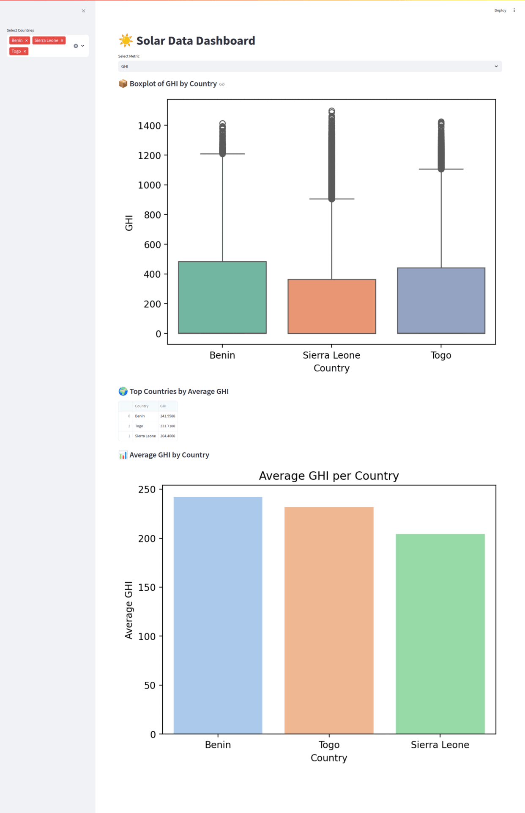

# solar-radiation-data-insights
Exploring solar radiation, weather conditions, and sensor performance data for analysis.

## 🎬 Streamlit App Demo



---

## 📌 Project Goals

- Analyze solar irradiance components (GHI, DNI, DHI) across different regions.
- Examine environmental factors like temperature, wind, and humidity affecting solar potential.
- Identify seasonal and geographic patterns relevant to renewable energy deployment.
- Evaluate sensor data consistency and detect anomalies or outliers.
- Provide insights to support solar energy system planning and optimization.

## 📁 Project Structure

```plaintext
project-root/
├── .venv/                 # Python virtual environment 
├── data/                  # Raw and cleaned datasets 
├── notebooks/             # Jupyter notebooks for EDA and analysis
├── scripts/               # Standalone Python scripts (e.g., cleaning, processing)
├── src/                   # Source code for reusable modules and functions
├── tests/                 # Unit and integration tests
├── .gitignore             # Git ignore file
├── requirements.txt       # Python dependencies
├── README.md              # Project overview and setup instructions
└── .github/
    └── workflows/         # GitHub Actions CI/CD workflows
        └── ci.yml
```

The notebooks include descriptive statistics and correlation analysis of each location's wind and temperature parameters.
